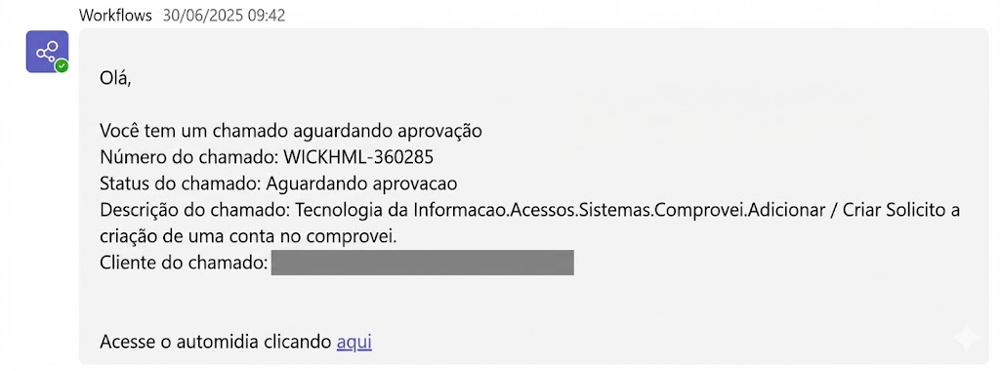

# 🔔 Approval Notifier

> **Chega de Gargalos.** Um sistema proativo que integra Python, Banco de Dados e Microsoft Teams para zerar a fila de aprovações pendentes.


---

## 📉 O Problema

O sistema de chamados (Requestia) dependia de uma ação passiva: o gestor precisava lembrar de logar no sistema para verificar se havia pendências. Resultado:
* **Atraso no SLA:** Chamados ficavam parados por dias simplesmente por falta de visualização.
* **Experiência Ruim:** Colaboradores esperando acessos ou ferramentas sem feedback.
* **Processo Manual:** Cobranças manuais via e-mail ou chat.

---

## ⚡ A Solução: Notificação Push Inteligente

Desenvolvi uma automação Backend que monitora o banco de dados do Requestia em tempo real e utiliza a infraestrutura da Microsoft (Logic Apps/Power Automate) para notificar o gestor exatamente onde ele trabalha: no **Teams**.

### Como funciona (Workflow)

1.  **Mining (Python + Oracle):** O script conecta via ODBC no banco de dados do Requestia e executa uma query buscando chamados com status `Aguardando Aprovação` + `SLA em risco`.
2.  **Logic Trigger:** Para cada pendência encontrada, o Python monta um payload JSON com os detalhes (ID, Solicitante, Descrição).
3.  **Webhook:** O script dispara uma requisição POST para um fluxo do **Logic Apps/Power Automate**.
4.  **Delivery:** O fluxo formata um *Adaptive Card* bonito e envia diretamente no chat privado do gestor responsável.

---

## 📸 Preview da Notificação

O gestor recebe um alerta visual claro, com todas as informações necessárias para decidir, sem precisar navegar por menus complexos.

<div align="center">
  
</div>

---

## 🛠️ Arquitetura da Integração

```mermaid
graph LR
    A[(DB Requestia)] -->|SQL Query| B[Script Python Service];
    B -->|Dados Tratados| C{Há Pendências?};
    C -- Sim --> D["Request POST (JSON Payload)"];
    D --> E[Azure Logic Apps / Power Automate];
    E -->|Adaptive Card| F["Microsoft Teams (Gestor)"];
    C -- Não --> G[Dorme por X minutos];
